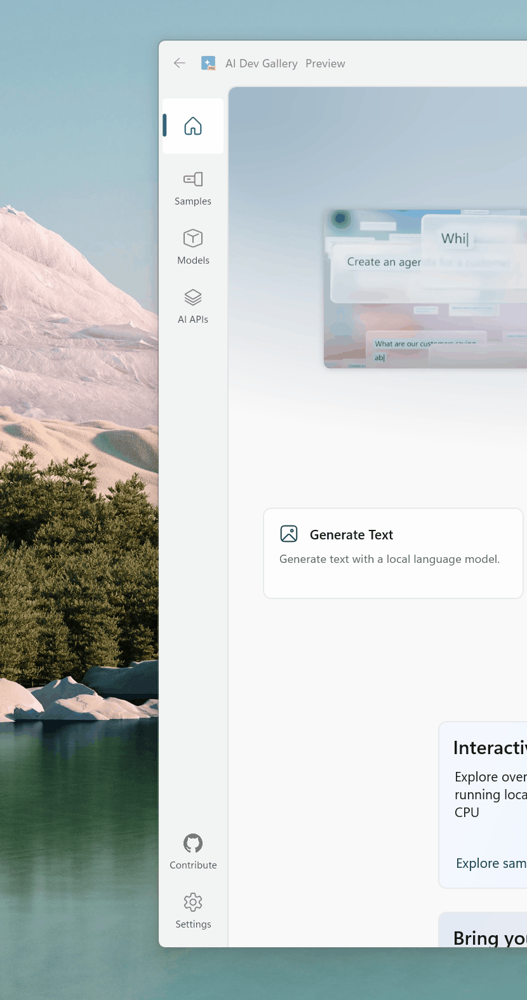

# Rail Menu Demo for WinUI 3

A standalone WinUI 3 project that provides the styles and helpers needed to recreate the **rail-style navigation** used in apps like the [Microsoft Store](https://apps.microsoft.com) and the [AI Dev Gallery](https://apps.microsoft.com/detail/9n9pn1mm3bd5).


<p align="center">
  
</p>

## What is a rail menu?

A rail menu is a compact, vertically-aligned navigation strip that sits on the left edge of the window. It shows **icon-only items** in its collapsed state and is always visible — giving users fast, glanceable access to top-level destinations without taking up much space. This pattern is used across several first-party Microsoft apps for a clean, modern look.

## What's included

| File / Folder | Purpose |
|---|---|
| `Styles/NavigationView.xaml` | Complete re-template of `NavigationView` and `NavigationViewItem` with rail-specific layout, sizing, selection visuals, and theme resources for **Dark**, **Light**, and **High Contrast** modes. |
| `Helpers/NavItemIconHelper.cs` | Attached properties for swapping between a **selected** and **unselected** icon, controlling static-icon visibility, and showing a **notification dot** on any nav item. |
| `MainWindow.xaml` | Demo window wiring up the `NavigationView` with the `MainNavigationViewStyle`, a `TitleBar`, and `Frame`-based page navigation. |

## Key features

- ✅ **Drop-in style** — apply `MainNavigationViewStyle` to any `NavigationView` to get the rail look instantly.
- 🎨 **Full theme support** — Dark, Light, and High Contrast theme dictionaries are all included.
- 🔔 **Notification dot** — show a small badge on any nav item via the `NavItemIconHelper.ShowNotificationDot` attached property.
- 🔀 **Selected / Unselected icons** — swap icon glyphs on selection for a polished experience.
- 🪟 **Mica backdrop & custom title bar** — the demo uses `MicaBackdrop` and WinUI 3's `TitleBar` control for a modern look.

## Prerequisites

- Windows 10 version 1809 (build 17763) or later
- [.NET 8 SDK](https://dotnet.microsoft.com/download/dotnet/8.0)
- [Windows App SDK 1.8](https://learn.microsoft.com/windows/apps/windows-app-sdk/)
- Visual Studio 2022 17.8+ with the **.NET desktop development** and **Windows application development** workloads

## Getting started

1. **Clone the repo**

   ```bash
   git clone https://github.com/svrooij/winui-rail-menu-demo.git
   cd winui-rail-menu-demo
   ```

2. **Open the solution** — open `RailMenuDemo.slnx` in Visual Studio.

3. **Build & Run** — select **x64** (or your preferred platform) and press <kbd>F5</kbd>.

## Using the rail style in your own project

1. **Copy** `Styles/NavigationView.xaml` and `Helpers/NavItemIconHelper.cs` into your project.

2. **Add the NuGet dependencies** used by the style:

   ```xml
   <PackageReference Include="CommunityToolkit.WinUI.Animations" Version="8.2.251219" />
   <PackageReference Include="CommunityToolkit.WinUI.Extensions" Version="8.2.251219" />
   ```

3. **Merge the resource dictionary** in your `App.xaml`:

   ```xml
   <ResourceDictionary.MergedDictionaries>
       <XamlControlsResources xmlns="using:Microsoft.UI.Xaml.Controls" />
       <ResourceDictionary Source="/Styles/NavigationView.xaml" />
   </ResourceDictionary.MergedDictionaries>
   ```

4. **Apply the style** to your `NavigationView`:

   ```xml
   <NavigationView Style="{StaticResource MainNavigationViewStyle}">
       <NavigationView.MenuItems>
           <NavigationViewItem Content="Home" Icon="Home" Tag="Home" />
           <!-- add more items -->
       </NavigationView.MenuItems>
       <NavigationView.Content>
           <Frame x:Name="NavFrame" />
       </NavigationView.Content>
   </NavigationView>
   ```

## Dependencies

| Package | Version | Why |
|---|---|---|
| [Microsoft.WindowsAppSDK](https://www.nuget.org/packages/Microsoft.WindowsAppSDK) | 1.8 | WinUI 3 runtime & controls |
| [CommunityToolkit.WinUI.Animations](https://www.nuget.org/packages/CommunityToolkit.WinUI.Animations) | 8.2 | Implicit animations in the style |
| [CommunityToolkit.WinUI.Extensions](https://www.nuget.org/packages/CommunityToolkit.WinUI.Extensions) | 8.2 | `FontIcon` markup extension and visual extensions |

## Blog post

For a step-by-step walkthrough of how this style was built, see the accompanying [blog post](https://svrooij.io/2026/04/07/build-rail-menu-winui/).

## License

This project is licensed under the [MIT License](LICENSE.txt).